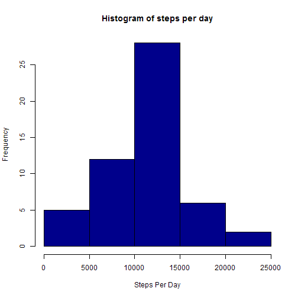
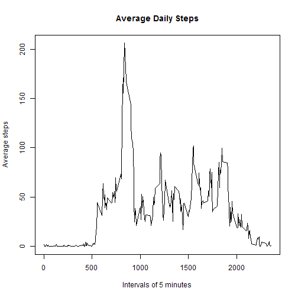
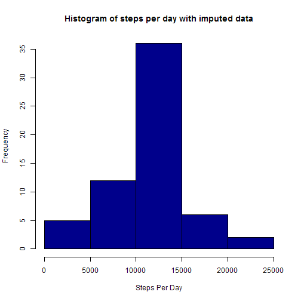
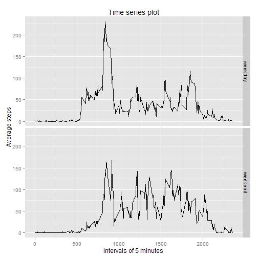

## 1. Loading and preprocessing the data

```r
if(!file.exists('activity.csv')){
  unzip("activity.zip")
}
activity <- read.csv('activity.csv', header=TRUE)
```

## 2. What is mean total number of steps taken per day?
* First we calculate the total steps per day using the summarize command of the dplyr package.  (We must load plyr first though.)


```r
require(plyr)
```

```
## Loading required package: plyr
```

```r
require(dplyr)
```

```
## Loading required package: dplyr
## 
## Attaching package: 'dplyr'
## 
## The following objects are masked from 'package:plyr':
## 
##     arrange, count, desc, failwith, id, mutate, rename, summarise,
##     summarize
## 
## The following object is masked from 'package:stats':
## 
##     filter
## 
## The following objects are masked from 'package:base':
## 
##     intersect, setdiff, setequal, union
```

```r
steps_per_day <- summarise(group_by(activity, date), sum(steps))
colnames(steps_per_day)[2] <- "total_steps"
```

* Next we create the histogram:


```r
hist(steps_per_day$total_steps, col="darkblue", main="Histogram of steps per day", xlab="Steps Per Day")
```

 

* And finally calculate the mean and median:

```r
mean <- mean(steps_per_day$total_steps, na.rm = TRUE)
median <- median(steps_per_day$total_steps, na.rm = TRUE)
```
So the mean is 1.0766189 &times; 10<sup>4</sup> and the median is 10765.

Optional: rm(mean, median, steps_per_day)

## 3. What is the average daily activity pattern?
* I interpreted this question to mean we should get the average steps per day for each interval, so I'll construct a new data frame.


```r
activity <- activity[complete.cases(activity[,1]), ]
steps_by_interval <- summarise(group_by(activity, interval), average = mean(steps, na.rm = TRUE))
steps_by_interval$interval <- ts(steps_by_interval$interval)
plot(steps_by_interval$interval, steps_by_interval$average, type="l", 
     main="Average Daily Steps", 
     xlab="Intervals of 5 minutes", 
     ylab="Average steps")
```

 

* 

```r
max_value <- max(steps_by_interval$average)
which_interval <- subset(steps_by_interval, average == max_value, select = interval)
```

## 4. Imputing missing values
* Well, I had to remove all the NAs from the data frame in order to get the summarize function to work.  Now the assignment calls for finding the number of NAs in the data frame, so we start over with a fresh reading of the file.

```r
activity <- read.csv('activity.csv', header=TRUE)
numNAs <- sum(is.na(activity$steps))
```
There are 2304 in the data frame.

* I decided to impute the average number of steps per interval to fill in the   missing values with a for loop.  For some reason I couldn't get my already-created steps_by_interval data to work with the for loop, so after some tearing out of hair and Googling I tried a different format.  I created a numeric array of essentially the same data:


```r
interval_average <-tapply(activity$steps, activity$interval,mean, na.rm=TRUE)
for (i in which(is.na(activity)))
{
    activity[i,1] <- interval_average[((i-1)%%288)+1]
}
```
I then checked it with sum(is.na(activity$steps)) and determined there were 0 NAs left in activity$steps.  Yay!

* Now to make a histogram... but the original activity data frame doesn't have the total steps per day, so we have to redo steps_per_day:

```r
new_steps_per_day <- summarise(group_by(activity, date), sum(steps))
colnames(new_steps_per_day)[2] <- "total_steps"

hist(new_steps_per_day$total_steps, col="darkblue", 
  main="Histogram of steps per day with imputed data", 
  xlab="Steps Per Day")
```

 

Calculate the mean and median again:

```r
new_mean <- mean(new_steps_per_day$total_steps)
new_median <- median(new_steps_per_day$total_steps)
```
The new mean is 1.0766189 &times; 10<sup>4</sup> and the new median is 1.0766189 &times; 10<sup>4</sup>.  Compared to the old values of 1.0766189 &times; 10<sup>4</sup> and 10765, they're essentially the same.  Maybe it's because I removed the NAs in the original mean and median?


```r
original_total <- sum(steps_per_day$total_steps, na.rm = TRUE)
new_total <- sum(new_steps_per_day$total_steps)
```
The new data frame does have more total steps per day, though.

## 5. Are there differences in activity patterns between weekdays and weekends?
* 

```r
weekday.or.weekend <- function(date) {
    day <- weekdays(date)
    if (day %in% c("Monday", "Tuesday", "Wednesday", "Thursday", "Friday"))
        return("weekday")
    else if (day %in% c("Saturday", "Sunday"))
        return("weekend")
    else
        stop("invalid date")
}
activity$date <- as.Date(activity$date)
activity$day_of_week <- sapply(activity$date, FUN=weekday.or.weekend)
activity$day_of_week <- factor(activity$day_of_week)
```

* Have to turn our intervals into a time series again before we can make the panel plot:


```r
activity$interval <- ts(activity$interval)
require(ggplot2)
```

```
## Loading required package: ggplot2
```

```r
averages <- aggregate(data=activity, steps ~ interval + day_of_week, FUN = "mean")
ggplot(averages, aes(interval, steps)) + geom_line() + facet_grid(day_of_week ~ .) +
  geom_line() +
  ggtitle("Time series plot") +
  labs(x = "Intervals of 5 minutes", y="Average steps")
```

 
